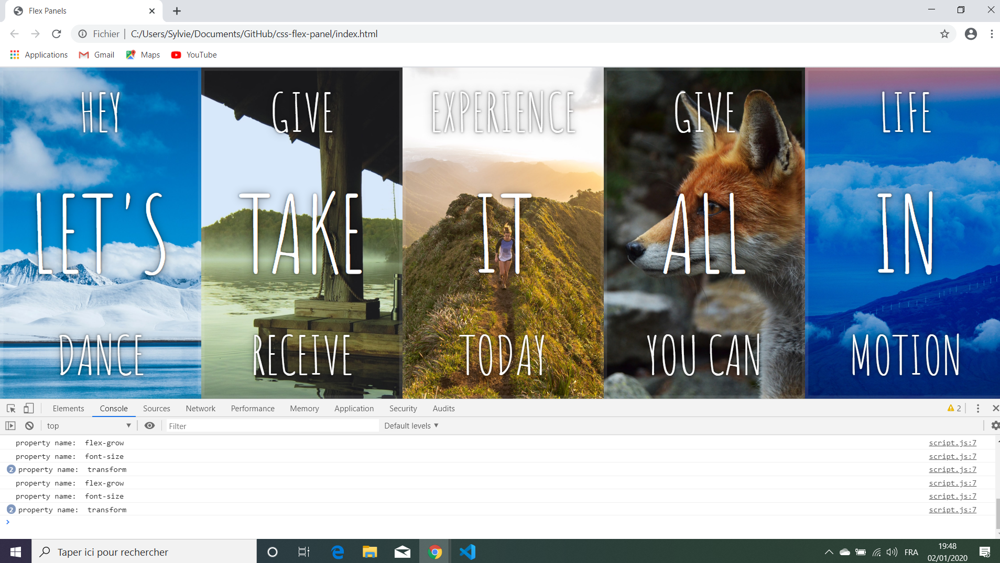

# :zap: Javascript CSS Flex

* Wes Bos Youtube Tutorial: [Flexbox + JavaScript Image Gallery — #JavaScript30 5/30](https://www.youtube.com/watch?v=9eif30i26jg&list=PLu8EoSxDXHP6CGK4YVJhL_VWetA865GOH&index=5).
* **Note:** to open web links in a new window use: _ctrl+click on link_


## :page_facing_up:Table of contents

* [:zap: Javascript CSS Flex](#zap-javascript-css-flex)
  * [:page_facing_up:Table of contents](#page_facing_uptable-of-contents)
  * [:books: General info](#books-general-info)
  * [:camera: Screenshots](#camera-screenshots)
  * [:signal_strength: Technologies](#signal_strength-technologies)
  * [:floppy_disk: Setup](#floppy_disk-setup)
  * [:computer: Code Examples](#computer-code-examples)
  * [:cool: Features](#cool-features)
  * [:clipboard: Status & To-Do List](#clipboard-status--to-do-list)
  * [:clap: Inspiration](#clap-inspiration)
  * [:file_folder: License](#file_folder-license)
  * [:envelope: Contact](#envelope-contact)

## :books: General info

* Tutorial Code to practise using css flex-box to display images and text.

## :camera: Screenshots

.

## :signal_strength: Technologies

* [Javascript ECMA-262 ECMAScript 2021](http://www.ecma-international.org/publications/standards/Ecma-262.htm)

## :floppy_disk: Setup

* Open index.html in browser. If any code is changed the browser needs to be refreshed.

## :computer: Code Examples

* toggle css class to open-active when panel selected.

```javascript
function toggleActive(e) {
  console.log('property name: ', e.propertyName); // returns flex-grow, font-size, transform
  if(e.propertyName.includes('flex')) { // to work with all browsers, incl firefox
     this.classList.toggle('open-active');
  }
}
```

## :cool: Features

* Panels resize as they are clicked to take up equal widths.

## :clipboard: Status & To-Do List

* Status: Working.
* To-Do: Nothing.

## :clap: Inspiration

* Wes Bos Youtube Tutorial: [Flexbox + JavaScript Image Gallery — #JavaScript30 5/30](https://www.youtube.com/watch?v=9eif30i26jg&list=PLu8EoSxDXHP6CGK4YVJhL_VWetA865GOH&index=5).

## :file_folder: License

* N/A

## :envelope: Contact

* Repo created by [ABateman](https://github.com/AndrewJBateman), email: gomezbateman@yahoo.com